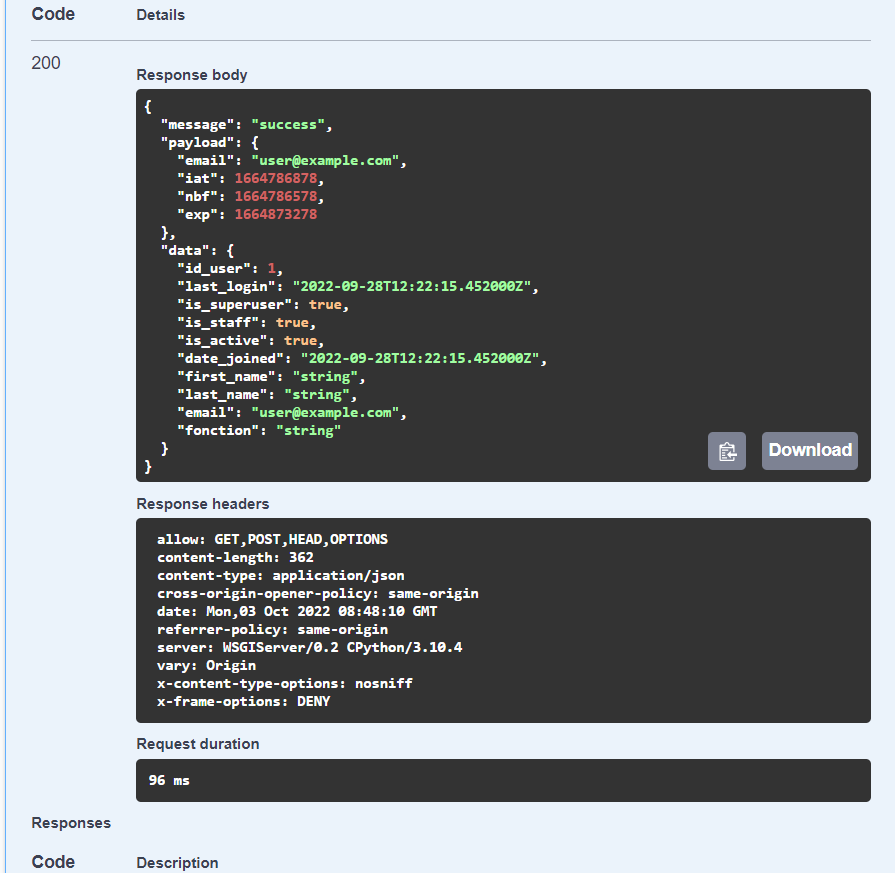

# sequencing_module

## Table of Contents
- [sequencing_module](#sequencing_module)
  - [Table of Contents](#table-of-contents)
  - [General Info](#general-info)
    - [1.Contextualization of the project](#1contextualization-of-the-project)
    - [2.Presentation of the project](#2presentation-of-the-project)
    - [Screenshot](#screenshot)
  - [Technologies](#technologies)
  - [Installation](#installation)
    - [1. A little intro about the installation.](#1-a-little-intro-about-the-installation)
    - [2.Side information:](#2side-information)
  - [FAQs](#faqs)
    - [1. **general documentation**](#1-general-documentation)
    - [2. Contact the developers](#2-contact-the-developers)


## General Info
***
### 1.Contextualization of the project
The Institute Pasteur has positioned itself as a hub in the field of sequencing and genomic monitoring in Africa. Many steps in this part are still manual (moving data on hard disk, freeing memory on the server)

### 2.Presentation of the project
The project consists in having a platform or a sequencing module that allows to overcome the problem linked to the sequencing process, i.e the sending of data after an action has been taken and to access and view data in real time on the platform
To do this, the project has a few objectives, which are :
* have a listener to notify if a run is finished.
* retrieve the metadata and the .fasta file
* give a description analysis on the trends(pathogen/variant) link with the teranga sample base for more exhaustive data (epidemio, clinical, data)


### Screenshot
* screenshot 1


* screenshot 2


* screenshot 3


* screenshot 4


* screenshot 5


* screenshot 6


## Technologies
***
A list of technologies used within the project:
* [Django](https://www.djangoproject.com): Version 12.3
* [django rest framework](https://www.django-rest-framework.org/): Version 2.34
* [mysqlclient](https://pypi.org/project/mysqlclient/):  Version 2.1.1
* [pyJWT](https://pypi.org/project/PyJWT/):  Version 2.5.0
* [drf-yasg swagger ui and redocs ui](https://pypi.org/project/drf-yasg/): Version 1.21.4
* [django-environ](https://pypi.org/project/django-environ/): Version 0.9.0


## Installation
***

### 1. A little intro about the installation.
```
$ git clone https://github.com/mamoudousow098/sequencing_module.git
$ cd ../path/to/the/file
$ pip install -r requirement.txt
$ python manage.py make migrations
$ python manage.py migrate
$ python manage.py runserver
```
### 2.Side information: 
To use the application in a special environment use 
```
after cloning the project and change the directory to the root directory of the project, you can create a  virtual environmment in python with these commands:
$ python -m venv nameOftheVitualEnv
if your plaftorm is windows , you can activate your virtual environment already created by the following command
$ path-to-the-virtual-env-directory\Scripts\activate.bat

Otherwise, if your plaftorm is UNix system, you can activate your virtual envrionment by these commands:
$source path-to-the-virtual-env-directory/bin/activate

after creating and activating your virtual environment, you can start the project by executing the steps in the introduction of the installation
``` 


## FAQs
***
A list of frequently asked questions
### 1. **general documentation**
you can debug or mastering any project with the offical website of the django and the django rest framework
* [Django](https://www.djangoproject.com)
* [django rest framework](https://www.django-rest-framework.org/)
### 2. Contact the developers
For further information you can directly contact the two developers of the project
* [Mamoudou Mamadou Sow](<MAILTO:smamadoumamoudou@ept.sn>)
* [Kadia Bassoum](<MAILTO:bkadia@ept.sn>)


